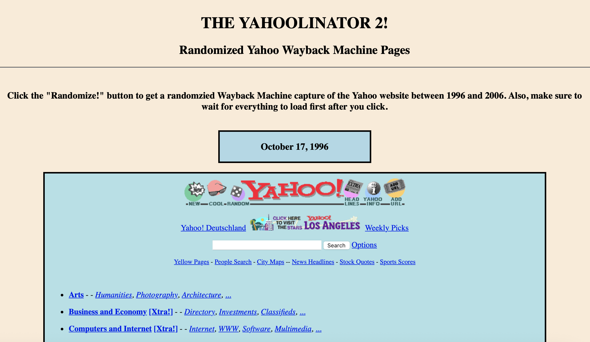

# THE YAHOOLINATOR 2! - Randomized Yahooligans Wayback Page

---

A year ago, I made this HTML project that browses random snapshots of the Yahooligans from the Wayback Machine to help me discover new Wayback Machine pages. I decided to tweak that idea little and use pages from the original Yahoo website instead.

What this project does is show you a random Wayback Machine capture of the Yahoo website from 1998 to 2006 everytime you click the "Randomize!" Button. You can also open up the page with the "Open In A New Tab" Button.

